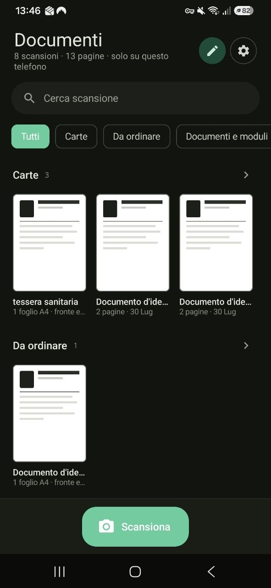
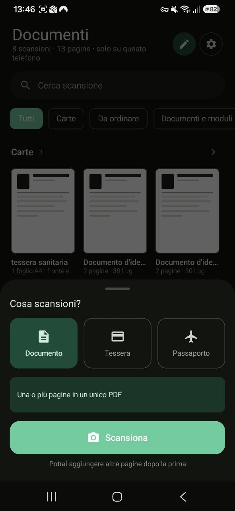

# DocScan

An Android document scanner. It scans documents and ID cards, pulls the data out
with on-device OCR, and keeps everything encrypted on the phone. No network.

<p align="center">
  
  
</p>

## What it does

- Multi-page document scanning to PDF.
- Front and back of an ID card, health card, driving licence or bank card on a
  single A4 sheet, printed at true 1:1 scale.
- On-device OCR that extracts Italian tax codes, MRZ lines, IBANs, VAT numbers,
  totals and dates.
- AES-256-GCM encrypted archive, organised into folders.
- Full-text search across scans.
- PDF export and sharing.
- Light, dark or system theme.

## Requirements

- Android 7.0 (API 24) or later.
- Google Play Services: the capture module comes from there.
- A physical device. The scanner does not work on emulators without Play Store.

## Layout

```
DocScan/
├── README.md
├── docs/                               screenshots used above
├── build.gradle.kts                    plugin versions
├── settings.gradle.kts
├── gradle.properties
├── gradlew  gradlew.bat                Gradle wrapper
├── gradle/wrapper/
└── app/
    ├── build.gradle.kts                module dependencies
    ├── proguard-rules.pro              kotlinx.serialization rules
    └── src/
        ├── main/
        │   ├── AndroidManifest.xml     no INTERNET permission, FileProvider
        │   ├── java/it/example/docscan/
        │   │   ├── MainActivity.kt         startup, navigation, system intents
        │   │   ├── data/
        │   │   │   ├── SecureStore.kt          AES-GCM on a Keystore key
        │   │   │   ├── DocumentRepository.kt   archive, folders, export
        │   │   │   ├── Model.kt                documents, folders, fields
        │   │   │   ├── ScanMode.kt             modes and ISO 7810 card sizes
        │   │   │   ├── A4Composer.kt           both sides on A4 at true scale
        │   │   │   ├── PdfBuilder.kt           multi-page PDF
        │   │   │   ├── AppSettings.kt          theme and default folder
        │   │   │   └── Images.kt               downsampled image decoding
        │   │   ├── ocr/
        │   │   │   ├── Ocr.kt                  ML Kit, on-device recognition
        │   │   │   ├── ItalianDocumentParser.kt tax code and MRZ
        │   │   │   └── FieldExtractor.kt       labelled fields, checks, PAN masking
        │   │   └── ui/
        │   │       ├── DocScanViewModel.kt     app state and operations
        │   │       ├── BottomSheet.kt          shared bottom sheet
        │   │       ├── Components.kt           card thumbnails, filter chips
        │   │       ├── DocumentActionsSheet.kt long-press menu, name dialog
        │   │       ├── FolderPickerSheet.kt    folder picker
        │   │       ├── library/LibraryScreen.kt   main screen
        │   │       ├── folder/FolderScreen.kt     folder contents
        │   │       ├── review/ReviewScreen.kt     post-scan review
        │   │       ├── review/A4Preview.kt        A4 sheet preview
        │   │       ├── detail/DetailScreen.kt     open document
        │   │       ├── scan/ScanModeSheet.kt      mode selection
        │   │       ├── settings/SettingsSheet.kt  settings
        │   │       └── theme/                     Color.kt, Theme.kt
        │   └── res/
        │       ├── values/          strings.xml, colors.xml, themes.xml
        │       ├── values-night/    themes.xml
        │       ├── drawable/        ic_launcher_foreground.xml
        │       ├── mipmap*/         launcher icons
        │       └── xml/             file_paths.xml, data_extraction_rules.xml
        └── test/java/it/example/docscan/
            ├── data/A4ComposerTest.kt      sheet geometry
            ├── data/FolderNameTest.kt      folder name uniqueness
            └── ocr/ParserTest.kt           tax code, MRZ, IBAN, PAN
```

The UI is entirely Jetpack Compose. There are no XML layouts.

Source comments are in Italian.

## Design notes

**No INTERNET permission.** The manifest does not declare one, so the app
process simply cannot send anything anywhere, and you can check that by opening
the manifest. The OCR model ships inside the APK and works in airplane mode.

Capture goes through ML Kit's Document Scanner, which runs inside the Google Play
Services process. Google states the images stay on the device, but it does
receive API usage metrics — anyone shipping this app has to tell their users so.

**Encryption.** Every file in the archive is AES-256-GCM encrypted with a
non-exportable key held in the Android Keystore. Previews are decrypted straight
into memory, so no plaintext file ever touches disk, except the temporary copy
made for sharing or exporting, which is wiped when the app comes back to the
foreground.

**True scale.** A4 composition starts in millimetres and writes the PDF in
PostScript points (1 mm = 72/25.4 pt). Print the sheet and an ID-1 card measures
85.6 × 54 mm on paper. An image has no physical unit, so its scale is lost the
first time it goes through a printer.

**Field extraction.** OCR returns the lines of the page rather than one flat
string: on an invoice the label and its value sit on the same line, and that is
the most reliable signal there is. Tax codes, MRZ lines, IBANs and VAT numbers
are validated against their own check digits. If a page is neither an identity
document nor a commercial one, nothing is extracted at all.

**Payment data.** Every run of 13 to 19 digits goes through a Luhn check. If it
passes, it is a card number: it never becomes a field, and it is masked in the
stored text with only the last four digits left.

## Not there yet

Roughly in order of usefulness.

- **Highlighting on the page.** ML Kit returns the bounding box of every line it
  recognises. Keeping those would let you tap a field and see where it was read
  from, instead of trusting a percentage.
- **Biometric lock.** Right now anyone holding the unlocked phone sees every
  document. It would take `setUserAuthenticationRequired(true)` on the Keystore
  key plus the prompt.
- **Retention.** The archive keeps documents forever. It needs at least a
  per-folder expiry and a warning on anything older than N months.
- **Multi-select.** Deleting or moving twenty scans one at a time is tedious.
- **Password on shared PDFs.** A copy sent over a messaging app stays in the
  clear on the recipient's phone.
- **The passport preset needs rethinking.** It assumes two sides like a card, but
  a passport has a single data page — one larger slot is probably right.
- **Drag to reorder folders.** There are up and down buttons for now.
